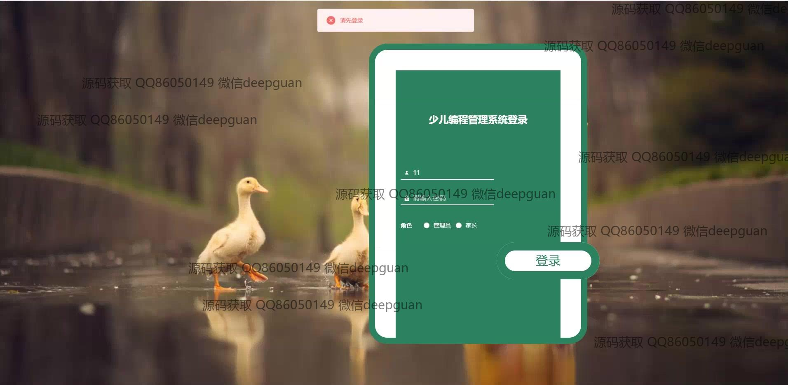

<h1 align="center">少儿编程管理系统</h1>

## 简介
少儿编程管理系统：提供课程信息管理、学生信息管理、家长管理、留言反馈、通知公告等功能，支持用户信息编辑、课程分类和购买课程管理，提升互动体验和管理效率。    --计算机毕业设计源码；毕设源码；java毕业设计源码

## 联系方式

<h3 align="center">获取完整代码与数据库文件 + 微信：deepguan QQ: 86050149 QQ群: 783742310</h3>

<h3 align="center">可帮忙远程部署 包运行成功！提供远程部署、修改代码、设计文档指导、代码讲解等服务！</h3>

## 功能介绍（完整见运行截图）
管理员：基本功能包括登录、注册和退出，能够访问导航栏、个人中心和系统管理等模块。可以进行课程信息管理、用户信息管理、留言反馈管理和公告发布。具备管理课程分类、学生信息、家长信息的权限并负责审核与操作用户评论。系统中还支持查看和编辑用户或学生详细信息，并能够上传和删除相关资料和媒体文件，还能进行后台管理和客服交流以确保系统高效运行与维护。

用户：基本功能涉及注册、登录和退出，能够通过首页导航栏进入课程信息、个人中心和关于课程的详细内容查看和购买操作。用户可以进行个人信息查看与修改，管理购买的课程，查看反馈留言和公告信息。可在系统中上传个人资料和对课程进行评论，并借助系统支持与在线客服进行互动交流。用户还能浏览和选择课程分类，快速检索所需的课程信息，以便优化学习体验与效率。

## 运行截图

本代码来源于网络,仅供学习参考使用!

